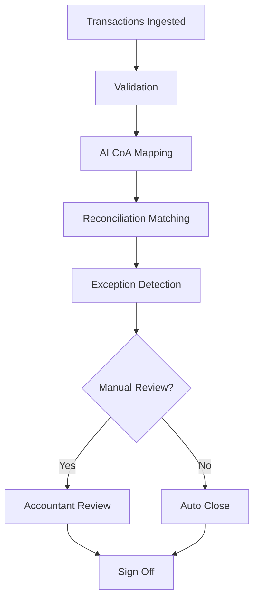

# 📊 Month-End Close Playbook

Designing and automating the Month-End Close process using AI, reconciliation systems, and structured controls.

---

## 🎯 Goal

- Reduce close cycle time  
- Improve reconciliation accuracy  
- Minimize manual workload  
- Ensure auditability  

---

## 🔄 High-Level Flow

---

## 📈 Core Metrics

- Days to close  
- Auto-match rate  
- Exception rate  
- Manual override %  
- Accuracy %  

