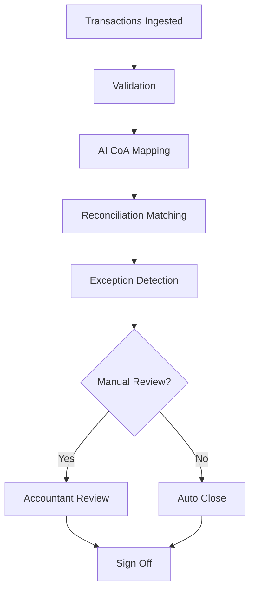

# 📊 Month-End Close Playbook

Designing and automating the Month-End Close process using AI, reconciliation systems, and structured controls.

---

## 🎯 Goal

- Reduce close cycle time  
- Improve reconciliation accuracy  
- Minimize manual workload  
- Ensure auditability  

---

## 🔄 High-Level Flow



---

## 📈 Core Metrics

- Days to close  
- Auto-match rate  
- Exception rate  
- Manual override %  
- Accuracy %

- ## 📂 Repository Structure

- /diagrams → System & workflow diagrams
- /docs → Decision frameworks & controls
- PRD_month_end_close.md → Full product specification

---

## 🧠 What This Repository Demonstrates

- Systems thinking
- AI decision frameworks
- Risk-aware product design
- Finance domain expertise
- End-to-end ownership


Add this section:

```markdown
## 🏗️ System Architecture Overview

The Month-End Close system consists of:

- Frontend (Finance Dashboard)
- API Gateway
- Close Orchestration Service
- Reconciliation Engine
- Journal Entry Engine
- PostgreSQL Databases
- ERP + Bank Integrations
- BI Reporting Layer

### Key Design Principles:
- Modular microservices
- Idempotent reconciliation jobs
- Audit logging at every step
- Retry logic for API failures
- Role-based access control


