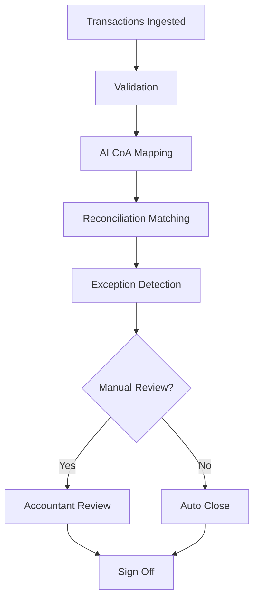

# 📊 Month-End Close Playbook

Designing and automating the Month-End Close process using AI, reconciliation systems, and structured controls.

---

## 🎯 Goal

- Reduce close cycle time  
- Improve reconciliation accuracy  
- Minimize manual workload  
- Ensure auditability  

---

## 🔄 High-Level Flow



---

## 📈 Core Metrics

- Days to close  
- Auto-match rate  
- Exception rate  
- Manual override %  
- Accuracy %

- ## 📂 Repository Structure

- /diagrams → System & workflow diagrams
- /docs → Decision frameworks & controls
- PRD_month_end_close.md → Full product specification

---

## 🧠 What This Repository Demonstrates

- Systems thinking
- AI decision frameworks
- Risk-aware product design
- Finance domain expertise
- End-to-end ownership


Add this section:

```markdown
## 🏗️ System Architecture Overview

The Month-End Close system consists of:

- Frontend (Finance Dashboard)
- API Gateway
- Close Orchestration Service
- Reconciliation Engine
- Journal Entry Engine
- PostgreSQL Databases
- ERP + Bank Integrations
- BI Reporting Layer

### Key Design Principles:
- Modular microservices
- Idempotent reconciliation jobs
- Audit logging at every step
- Retry logic for API failures
- Role-based access control

=======================
I am adding more to the README so it makes sense :)

# 🧾 Month-End Close Automation System  
### A Product + Systems Case Study in Fintech Infrastructure

> Reducing financial close cycle from 10 days → 4 days  
> Improving reconciliation accuracy to 98.5%  
> Cutting manual effort by 60%

---

## 🏢 Context

Finance teams often struggle with:

- Manual reconciliation in Excel
- Lack of real-time close visibility
- Delayed variance detection
- High journal posting errors
- Poor audit traceability

This project models a scalable, audit-ready **Month-End Close Automation System** designed for modern finance teams.

---

## 🎯 Problem Statement

How might we reduce month-end close duration by 50% while improving accuracy, visibility, and auditability?

---

## 🧠 Solution Overview

This system introduces:

- 📊 Close Orchestration Dashboard
- 🔁 Automated Reconciliation Engine
- ⚠️ Variance Detection & Alerts
- 🧾 Journal Entry Automation
- 🧑‍⚖️ Audit Trail & Compliance Layer

---

# 🏗️ System Architecture

```mermaid
flowchart LR
    A[Finance Users] --> B[Frontend Dashboard]
    B --> C[API Gateway]
    C --> D[Auth Service]
    C --> E[Close Orchestrator]
    C --> F[Reconciliation Engine]
    C --> G[Journal Service]

    F --> H[(Bank APIs)]
    F --> I[(ERP Integration)]

    E --> J[(Close DB)]
    F --> K[(Transactions DB)]
    G --> L[(Ledger DB)]

    J --> M[Reporting Service]
    M --> N[BI Dashboard]


