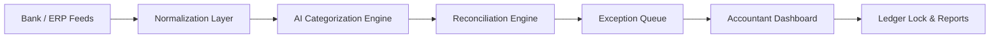

# Overall Month-End Close Architecture

```mermaid
flowchart LR
    A[Bank / ERP Feeds] --> B[Normalization Layer]
    B --> C[AI Categorization Engine]
    C --> D[Reconciliation Engine]
    D --> E[Exception Queue]
    E --> F[Accountant Dashboard]
    F --> G[Ledger Lock & Reports]
```
