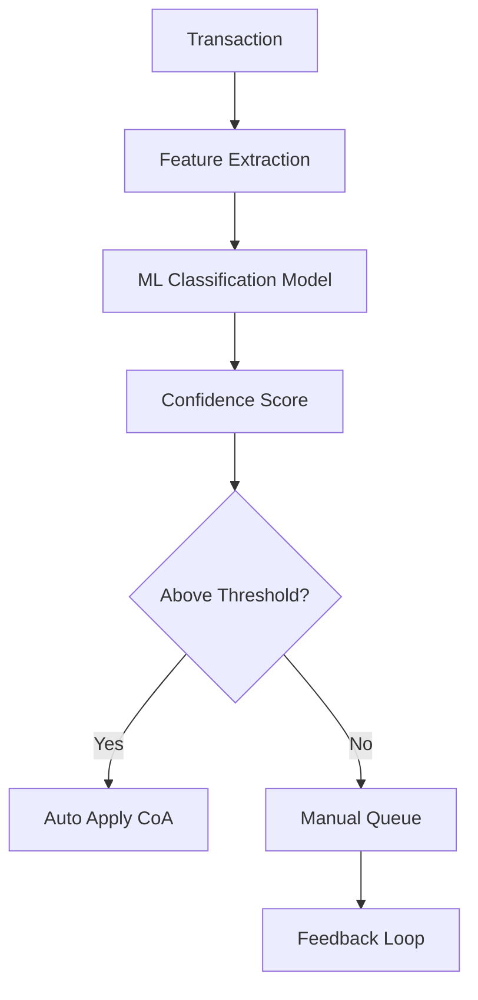

# AI Matching Logic

```mermaid
flowchart TD
    A[Transaction] --> B[Feature Extraction]
    B --> C[ML Classification Model]
    C --> D[Confidence Score]
    D --> E{Above Threshold?}
    E -- Yes --> F[Auto Apply CoA]
    E -- No --> G[Manual Queue]
    G --> H[Feedback Loop]
```
